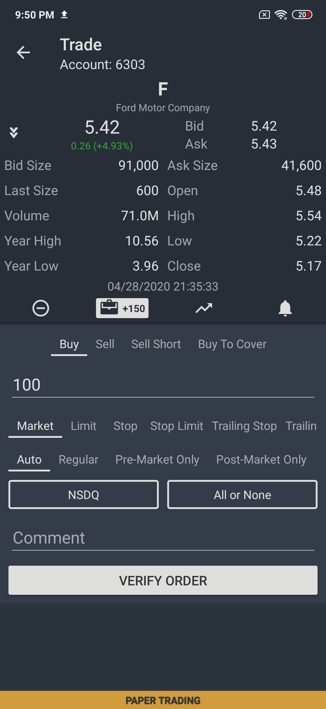
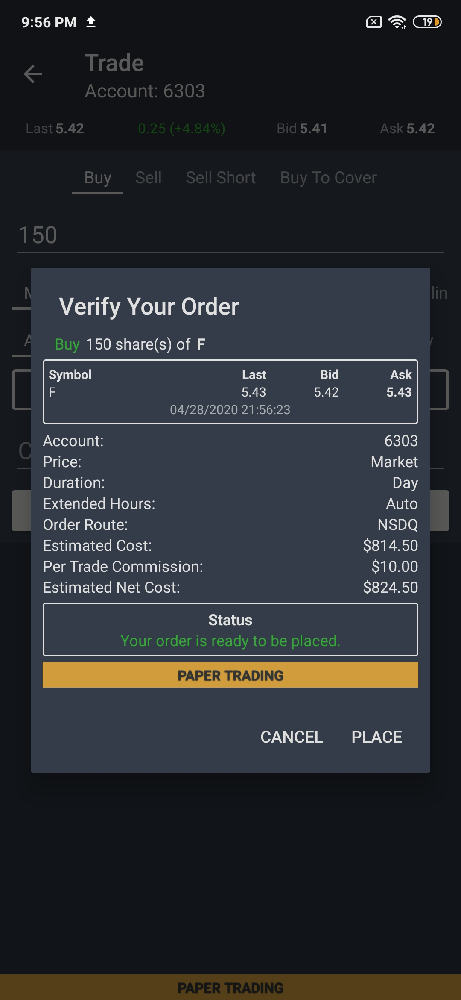

# Trade View

## Introduction

Autoshares Web Trader for Android offers full-fledged functionality for trading, enabling traders to open positions in both stocks and options. Whether a trader wants to open a long, short, or buy-to-cover position, they can do so by tapping on the **Trade** button in the top-right corner.

## Placing an Order

This will bring up the the trade view where you can meticulously configure the order:

In total, there are four configurable order sides: **Buy**, **Sell**, **Sell** **Short**, and **Buy-To-Cover**.

Once you have selected the required order type, next, specify the number of securities to be purchased. When specifying the quantity, don't forget that it will be multiplied by the contract size applicable to this security.

Next, specify the order type. It can be either **Market**, **Limit**, **Stop**, **Stop Limit**, **Trailing** **Stop**, and **Trailing Stop Limit**. The range of parameters that must be specified varies depending on the specified order type. Namely, limit orders require specification of the limit price, trailing stop orders require specification of the price offset, etc.

Next, specify the target trading session for the order. If the target trading session will start later than the time at which the order is placed, the order will be suspended until then. To select the regular trading session, set this parameter to **Auto**.

Finally, you can optionally select the target execution venue where the order should be executed. You can also ensure that this order executes in its entirety rather than as a sequence of partial fills by tapping **All or None**. You may also provide an accompanying comment for this order — this might be useful for reminding yourself the reason for entering this trade.

## Verifying the Order's Details

Once the order is completely configured, tap **Verify Order**. This will bring up the order verification view where you can ensure that the order is properly configured before proceeding to place it on the execution venue. This view might also display any possible conflicts like insufficient buying power, exceeding the limit for day trades, etc.

If the order is properly configured, tap **Place** and the order will immediately be placed.

